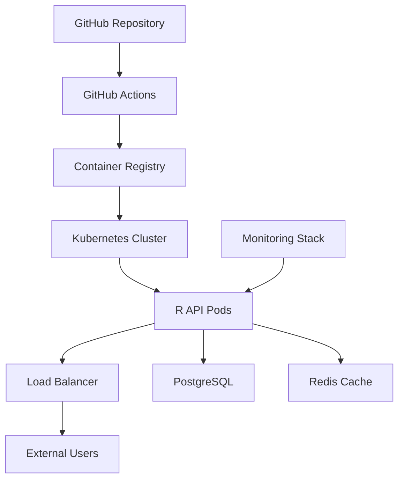

# R Production Infrastructure Setup

Complete infrastructure setup for deploying R applications at scale with monitoring, CI/CD, and best practices.

## Table of Contents

- [Infrastructure Overview](#infrastructure-overview)
- [Container Strategy](#container-strategy)
- [Kubernetes Setup](#kubernetes-setup)
- [Cloud Platforms](#cloud-platforms)
- [Monitoring & Observability](#monitoring--observability)
- [Security Configuration](#security-configuration)

## Infrastructure Overview

### Architecture Components



### Technology Stack

- **Container Runtime**: Docker with rocker base images
- **Orchestration**: Kubernetes or Cloud Run
- **Package Management**: renv for reproducibility
- **API Framework**: Plumber with authentication
- **Database**: PostgreSQL with connection pooling
- **Caching**: Redis for performance
- **Monitoring**: Prometheus + Grafana

## Container Strategy

### Multi-stage Production Dockerfile

```dockerfile
# Dockerfile.production
ARG R_VERSION=4.3.2
FROM rocker/r-ver:${R_VERSION} AS base

# Install system dependencies
RUN apt-get update && apt-get install -y \
    libcurl4-openssl-dev \
    libssl-dev \
    libxml2-dev \
    libpq-dev \
    libsodium-dev \
    git \
    && rm -rf /var/lib/apt/lists/*

# Install renv
ENV RENV_VERSION 1.0.3
RUN R -e "install.packages('remotes', repos = c(CRAN = 'https://cloud.r-project.org'))"
RUN R -e "remotes::install_github('rstudio/renv@${RENV_VERSION}')"

# Development stage
FROM base AS development
RUN apt-get update && apt-get install -y vim htop curl
RUN R -e "install.packages(c('devtools', 'testthat', 'covr'), repos = c(CRAN = 'https://cloud.r-project.org'))"
WORKDIR /workspace

# Dependencies stage
FROM base AS dependencies
WORKDIR /app
COPY renv.lock renv.lock
COPY renv/activate.R renv/activate.R
COPY renv/settings.dcf renv/settings.dcf
RUN R -e "renv::restore()"

# Production stage
FROM dependencies AS production
COPY . /app
RUN useradd --create-home --shell /bin/bash ruser && \
    chown -R ruser:ruser /app
USER ruser
EXPOSE 8000
HEALTHCHECK --interval=30s --timeout=3s --start-period=5s --retries=3 \
  CMD curl -f http://localhost:8000/health || exit 1
CMD ["R", "-e", "source('main.R')"]
```

### Container Optimization

```r
# optimize-container.R
optimize_r_container <- function() {
  # Configure R for production
  options(
    repos = c(CRAN = "https://packagemanager.rstudio.com/cran/__linux__/focal/latest"),
    Ncpus = parallel::detectCores(),
    timeout = 300,
    warn = 1,
    error = function(e) {
      logging::logwarn("Error occurred: %s", e$message)
      quit(status = 1)
    }
  )
  
  # Memory management
  if (Sys.getenv("MEMORY_LIMIT") != "") {
    memory_limit <- as.numeric(Sys.getenv("MEMORY_LIMIT", "4000"))
    options(memory.limit = memory_limit)
  }
  
  # Garbage collection optimization
  options(
    expressions = 500000,
    keep.source = FALSE,
    keep.source.pkgs = FALSE
  )
  
  # Parallel processing setup
  if (require("parallel", quietly = TRUE)) {
    options(mc.cores = parallel::detectCores())
  }
}

# Performance monitoring
monitor_performance <- function() {
  list(
    memory_usage = gc(verbose = FALSE)[, c("used", "max used")],
    system_info = Sys.info(),
    r_version = R.version.string,
    loaded_packages = (.packages()),
    session_info = sessionInfo()
  )
}
```

## Kubernetes Setup

### R Application Deployment

```yaml
# k8s/r-deployment.yaml
apiVersion: apps/v1
kind: Deployment
metadata:
  name: r-api
  labels:
    app: r-api
    version: v1
spec:
  replicas: 3
  strategy:
    type: RollingUpdate
    rollingUpdate:
      maxSurge: 1
      maxUnavailable: 0
  selector:
    matchLabels:
      app: r-api
  template:
    metadata:
      labels:
        app: r-api
        version: v1
      annotations:
        prometheus.io/scrape: "true"
        prometheus.io/port: "8000"
        prometheus.io/path: "/metrics"
    spec:
      securityContext:
        fsGroup: 1000
        runAsNonRoot: true
        runAsUser: 1000
      containers:
      - name: r-api
        image: gcr.io/PROJECT_ID/r-api:latest
        imagePullPolicy: Always
        ports:
        - containerPort: 8000
          name: http
        env:
        - name: R_ENV
          value: "production"
        - name: PORT
          value: "8000"
        - name: DB_HOST
          valueFrom:
            configMapKeyRef:
              name: r-config
              key: db_host
        - name: DB_PASSWORD
          valueFrom:
            secretKeyRef:
              name: r-secrets
              key: db_password
        - name: REDIS_URL
          valueFrom:
            configMapKeyRef:
              name: r-config
              key: redis_url
        resources:
          requests:
            memory: "1Gi"
            cpu: "500m"
          limits:
            memory: "2Gi"
            cpu: "1000m"
        livenessProbe:
          httpGet:
            path: /health
            port: 8000
          initialDelaySeconds: 30
          periodSeconds: 10
          timeoutSeconds: 5
        readinessProbe:
          httpGet:
            path: /ready
            port: 8000
          initialDelaySeconds: 5
          periodSeconds: 5
          timeoutSeconds: 3
        lifecycle:
          preStop:
            exec:
              command: ["/bin/sh", "-c", "sleep 15"]
        securityContext:
          allowPrivilegeEscalation: false
          capabilities:
            drop:
            - ALL
          readOnlyRootFilesystem: true
        volumeMounts:
        - name: tmp
          mountPath: /tmp
        - name: r-cache
          mountPath: /home/ruser/.cache
      volumes:
      - name: tmp
        emptyDir: {}
      - name: r-cache
        emptyDir: {}
      terminationGracePeriodSeconds: 30

---
apiVersion: v1
kind: Service
metadata:
  name: r-api-service
  labels:
    app: r-api
spec:
  type: ClusterIP
  ports:
  - port: 80
    targetPort: 8000
    protocol: TCP
    name: http
  selector:
    app: r-api

---
apiVersion: networking.k8s.io/v1
kind: Ingress
metadata:
  name: r-api-ingress
  annotations:
    nginx.ingress.kubernetes.io/rewrite-target: /
    nginx.ingress.kubernetes.io/ssl-redirect: "true"
    cert-manager.io/cluster-issuer: "letsencrypt-prod"
    nginx.ingress.kubernetes.io/rate-limit: "100"
    nginx.ingress.kubernetes.io/rate-limit-window: "1m"
spec:
  tls:
  - hosts:
    - api.yourdomain.com
    secretName: r-api-tls
  rules:
  - host: api.yourdomain.com
    http:
      paths:
      - path: /
        pathType: Prefix
        backend:
          service:
            name: r-api-service
            port:
              number: 80
```

### Configuration Management

```yaml
# k8s/configmap.yaml
apiVersion: v1
kind: ConfigMap
metadata:
  name: r-config
data:
  db_host: "postgres-service"
  db_port: "5432"
  db_name: "rdata"
  redis_url: "redis://redis-service:6379/0"
  log_level: "INFO"
  max_connections: "100"
  cache_ttl: "3600"

---
apiVersion: v1
kind: Secret
metadata:
  name: r-secrets
type: Opaque
stringData:
  db_password: "your_secure_password"
  api_key: "your_api_key"
  jwt_secret: "your_jwt_secret"
```

### Horizontal Pod Autoscaler

```yaml
# k8s/hpa.yaml
apiVersion: autoscaling/v2
kind: HorizontalPodAutoscaler
metadata:
  name: r-api-hpa
spec:
  scaleTargetRef:
    apiVersion: apps/v1
    kind: Deployment
    name: r-api
  minReplicas: 3
  maxReplicas: 20
  metrics:
  - type: Resource
    resource:
      name: cpu
      target:
        type: Utilization
        averageUtilization: 70
  - type: Resource
    resource:
      name: memory
      target:
        type: Utilization
        averageUtilization: 80
  behavior:
    scaleDown:
      stabilizationWindowSeconds: 300
      policies:
      - type: Percent
        value: 10
        periodSeconds: 60
    scaleUp:
      stabilizationWindowSeconds: 60
      policies:
      - type: Percent
        value: 50
        periodSeconds: 60
```

## Cloud Platforms

### Google Cloud Platform Setup

```r
# gcp-setup.R
library(googleCloudRunner)
library(googleCloudStorageR)

setup_gcp_infrastructure <- function(project_id, region = "us-central1") {
  
  # Set up Cloud Run
  cr_setup(project_id = project_id, region = region)
  
  # Build and deploy
  build_config <- cr_build_yaml(
    steps = list(
      cr_buildstep_docker("r-api", tag = "gcr.io/$PROJECT_ID/r-api"),
      cr_buildstep_run(
        name = "r-api",
        image = "gcr.io/$PROJECT_ID/r-api",
        env = c(
          "R_ENV=production",
          "PORT=8080"
        ),
        memory = "2Gi",
        cpu = 2,
        port = 8080,
        allowUnauthenticated = TRUE,
        concurrency = 100,
        maxScale = 20
      )
    )
  )
  
  # Deploy infrastructure
  build <- cr_build_make(build_config)
  result <- cr_build(build)
  
  # Setup Cloud SQL
  setup_cloud_sql(project_id, region)
  
  # Setup monitoring
  setup_monitoring(project_id)
  
  return(result)
}

setup_cloud_sql <- function(project_id, region) {
  # Cloud SQL instance creation
  instance_config <- list(
    name = "r-postgres",
    databaseVersion = "POSTGRES_14",
    region = region,
    settings = list(
      tier = "db-custom-2-7680",
      backupConfiguration = list(
        enabled = TRUE,
        startTime = "03:00"
      ),
      ipConfiguration = list(
        authorizedNetworks = list()
      )
    )
  )
  
  # This would typically be done via gcloud CLI or Terraform
  cat("Cloud SQL configuration:", jsonlite::toJSON(instance_config, pretty = TRUE))
}
```

### AWS Infrastructure with CDK

```r
# aws-cdk-setup.R
create_aws_infrastructure <- function() {
  # This would be implemented using AWS CDK for R or Terraform
  infrastructure_config <- list(
    vpc = list(
      cidr = "10.0.0.0/16",
      public_subnets = c("10.0.1.0/24", "10.0.2.0/24"),
      private_subnets = c("10.0.3.0/24", "10.0.4.0/24")
    ),
    ecs = list(
      cluster_name = "r-cluster",
      service_name = "r-api-service",
      task_cpu = 1024,
      task_memory = 2048,
      desired_count = 3
    ),
    rds = list(
      engine = "postgres",
      instance_class = "db.t3.micro",
      allocated_storage = 20,
      multi_az = TRUE
    ),
    alb = list(
      name = "r-api-alb",
      scheme = "internet-facing",
      target_group_port = 8000
    )
  )
  
  # Generate Terraform configuration
  generate_terraform_config(infrastructure_config)
}

generate_terraform_config <- function(config) {
  terraform_config <- sprintf('
provider "aws" {
  region = "us-west-2"
}

module "vpc" {
  source = "terraform-aws-modules/vpc/aws"
  
  name = "r-api-vpc"
  cidr = "%s"
  
  azs             = ["us-west-2a", "us-west-2b"]
  public_subnets  = %s
  private_subnets = %s
  
  enable_nat_gateway = true
  enable_vpn_gateway = false
}

module "ecs" {
  source = "terraform-aws-modules/ecs/aws"
  
  cluster_name = "%s"
}
', 
    config$vpc$cidr,
    jsonlite::toJSON(config$vpc$public_subnets),
    jsonlite::toJSON(config$vpc$private_subnets),
    config$ecs$cluster_name
  )
  
  writeLines(terraform_config, "infrastructure.tf")
  cat("Terraform configuration generated\n")
}
```

## Monitoring & Observability

### Application Metrics

```r
# monitoring.R
library(prometheus)
library(logging)

# Initialize metrics
initialize_metrics <- function() {
  # Counter for requests
  request_counter <<- prometheus::counter(
    "http_requests_total",
    "Total HTTP requests",
    labels = c("method", "endpoint", "status")
  )
  
  # Histogram for response times
  response_time_histogram <<- prometheus::histogram(
    "http_request_duration_seconds",
    "HTTP request duration",
    labels = c("method", "endpoint"),
    buckets = c(0.001, 0.01, 0.1, 0.5, 1, 2.5, 5, 10)
  )
  
  # Gauge for active connections
  active_connections_gauge <<- prometheus::gauge(
    "active_connections",
    "Number of active connections"
  )
  
  # Business metrics
  predictions_counter <<- prometheus::counter(
    "predictions_total",
    "Total predictions made",
    labels = c("model_version", "outcome")
  )
}

# Middleware for metrics collection
metrics_middleware <- function(req, res) {
  start_time <- Sys.time()
  
  # Track active connections
  active_connections_gauge$inc()
  
  # Continue with request
  result <- plumber::forward()
  
  # Record metrics
  end_time <- Sys.time()
  duration <- as.numeric(difftime(end_time, start_time, units = "secs"))
  
  request_counter$inc(
    labels = list(
      method = req$REQUEST_METHOD,
      endpoint = req$PATH_INFO,
      status = res$status
    )
  )
  
  response_time_histogram$observe(
    duration,
    labels = list(
      method = req$REQUEST_METHOD,
      endpoint = req$PATH_INFO
    )
  )
  
  active_connections_gauge$dec()
  
  return(result)
}

# Health check with detailed status
health_check <- function() {
  status <- "healthy"
  checks <- list()
  
  # Database connectivity
  tryCatch({
    conn <- DBI::dbConnect(RPostgres::Postgres(),
                          host = Sys.getenv("DB_HOST"),
                          dbname = Sys.getenv("DB_NAME"),
                          user = Sys.getenv("DB_USER"),
                          password = Sys.getenv("DB_PASSWORD"))
    DBI::dbGetQuery(conn, "SELECT 1")
    DBI::dbDisconnect(conn)
    checks$database <- "healthy"
  }, error = function(e) {
    checks$database <<- "unhealthy"
    status <<- "unhealthy"
  })
  
  # Redis connectivity
  tryCatch({
    redis_conn <- redux::hiredis(
      redux::redis_config(url = Sys.getenv("REDIS_URL"))
    )
    redis_conn$PING()
    checks$redis <- "healthy"
  }, error = function(e) {
    checks$redis <<- "unhealthy"
    status <<- "degraded"
  })
  
  # Memory usage
  memory_info <- gc(verbose = FALSE)
  memory_used <- sum(memory_info[, "used"])
  memory_limit <- as.numeric(Sys.getenv("MEMORY_LIMIT", "2000"))
  
  if (memory_used > memory_limit * 0.9) {
    checks$memory <- "warning"
    status <- "degraded"
  } else {
    checks$memory <- "healthy"
  }
  
  list(
    status = status,
    timestamp = Sys.time(),
    version = packageVersion("your_package"),
    checks = checks,
    uptime = Sys.time() - .GlobalEnv$start_time
  )
}

# Structured logging
setup_logging <- function() {
  log_level <- Sys.getenv("LOG_LEVEL", "INFO")
  
  logging::basicConfig(level = log_level)
  
  # Custom formatter for JSON logs
  json_formatter <- function(record) {
    log_entry <- list(
      timestamp = format(Sys.time(), "%Y-%m-%dT%H:%M:%S%z"),
      level = record$levelname,
      message = record$msg,
      logger = record$name,
      module = record$module,
      function_name = record$funcName,
      line_number = record$lineno
    )
    
    return(jsonlite::toJSON(log_entry, auto_unbox = TRUE))
  }
  
  # Set formatter if in production
  if (Sys.getenv("R_ENV") == "production") {
    logging::addHandler(
      logging::writeToConsole,
      formatter = json_formatter
    )
  }
}
```

### Grafana Dashboard Configuration

```json
{
  "dashboard": {
    "title": "R API Monitoring",
    "panels": [
      {
        "title": "Request Rate",
        "type": "graph",
        "targets": [
          {
            "expr": "rate(http_requests_total[5m])",
            "legendFormat": "{{method}} {{endpoint}}"
          }
        ]
      },
      {
        "title": "Response Time",
        "type": "graph", 
        "targets": [
          {
            "expr": "histogram_quantile(0.95, rate(http_request_duration_seconds_bucket[5m]))",
            "legendFormat": "95th percentile"
          },
          {
            "expr": "histogram_quantile(0.50, rate(http_request_duration_seconds_bucket[5m]))",
            "legendFormat": "50th percentile"
          }
        ]
      },
      {
        "title": "Error Rate",
        "type": "singlestat",
        "targets": [
          {
            "expr": "rate(http_requests_total{status=~\"5..\"}[5m]) / rate(http_requests_total[5m])",
            "legendFormat": "Error Rate"
          }
        ]
      },
      {
        "title": "Active Connections",
        "type": "graph",
        "targets": [
          {
            "expr": "active_connections",
            "legendFormat": "Active Connections"
          }
        ]
      }
    ]
  }
}
```

## Security Configuration

### Authentication & Authorization

```r
# security.R
library(jose)
library(sodium)

# JWT authentication
authenticate_jwt <- function(token) {
  tryCatch({
    # Verify JWT token
    secret <- Sys.getenv("JWT_SECRET")
    payload <- jose::jwt_decode_sig(token, secret)
    
    # Check expiration
    if (payload$exp < as.numeric(Sys.time())) {
      return(list(valid = FALSE, reason = "Token expired"))
    }
    
    # Check required claims
    if (is.null(payload$sub) || is.null(payload$role)) {
      return(list(valid = FALSE, reason = "Missing required claims"))
    }
    
    return(list(
      valid = TRUE,
      user_id = payload$sub,
      role = payload$role,
      permissions = payload$permissions %||% c()
    ))
    
  }, error = function(e) {
    return(list(valid = FALSE, reason = "Invalid token"))
  })
}

# API key authentication
authenticate_api_key <- function(api_key) {
  # Hash the provided key
  key_hash <- sodium::sha256(charToRaw(api_key))
  
  # Compare with stored hash (in production, this would be from database)
  stored_hashes <- list(
    "user1" = Sys.getenv("USER1_API_KEY_HASH"),
    "service1" = Sys.getenv("SERVICE1_API_KEY_HASH")
  )
  
  for (user in names(stored_hashes)) {
    if (identical(key_hash, hex2raw(stored_hashes[[user]]))) {
      return(list(
        valid = TRUE,
        user_id = user,
        type = "api_key"
      ))
    }
  }
  
  return(list(valid = FALSE, reason = "Invalid API key"))
}

# Rate limiting
rate_limiter <- function(identifier, max_requests = 100, window_seconds = 3600) {
  if (!exists("rate_limit_store", envir = .GlobalEnv)) {
    .GlobalEnv$rate_limit_store <- list()
  }
  
  now <- as.numeric(Sys.time())
  
  # Clean old entries
  .GlobalEnv$rate_limit_store <- Filter(function(x) {
    now - x$timestamp < window_seconds
  }, .GlobalEnv$rate_limit_store)
  
  # Check current count for identifier
  identifier_requests <- Filter(function(x) {
    x$identifier == identifier && now - x$timestamp < window_seconds
  }, .GlobalEnv$rate_limit_store)
  
  if (length(identifier_requests) >= max_requests) {
    return(list(allowed = FALSE, remaining = 0))
  }
  
  # Record this request
  .GlobalEnv$rate_limit_store <- append(
    .GlobalEnv$rate_limit_store,
    list(list(identifier = identifier, timestamp = now))
  )
  
  remaining <- max_requests - length(identifier_requests) - 1
  return(list(allowed = TRUE, remaining = remaining))
}

# Input validation and sanitization
validate_input <- function(data, schema) {
  errors <- c()
  
  for (field in names(schema)) {
    field_schema <- schema[[field]]
    value <- data[[field]]
    
    # Required check
    if (field_schema$required && (is.null(value) || is.na(value))) {
      errors <- c(errors, paste("Field", field, "is required"))
      next
    }
    
    if (!is.null(value)) {
      # Type check
      if (!is.null(field_schema$type)) {
        if (field_schema$type == "numeric" && !is.numeric(value)) {
          errors <- c(errors, paste("Field", field, "must be numeric"))
        } else if (field_schema$type == "character" && !is.character(value)) {
          errors <- c(errors, paste("Field", field, "must be character"))
        }
      }
      
      # Range check for numeric values
      if (is.numeric(value) && !is.null(field_schema$range)) {
        if (value < field_schema$range[1] || value > field_schema$range[2]) {
          errors <- c(errors, paste("Field", field, "out of range"))
        }
      }
      
      # String length check
      if (is.character(value) && !is.null(field_schema$max_length)) {
        if (nchar(value) > field_schema$max_length) {
          errors <- c(errors, paste("Field", field, "too long"))
        }
      }
    }
  }
  
  if (length(errors) > 0) {
    return(list(valid = FALSE, errors = errors))
  }
  
  return(list(valid = TRUE))
}
```

## Related Resources

- [Container Best Practices](../docker/)
- [Kubernetes Deployment](../kubernetes/)
- [Monitoring Setup](../../tools/monitoring/)
- [Security Guidelines](../../knowledge/best-practices/)
- [CI/CD Pipelines](../../devops/)

## Contributing

When adding R infrastructure patterns:
1. Test across different R versions and platforms
2. Include resource requirements and scaling guidelines
3. Document security considerations
4. Provide monitoring and alerting examples
5. Add troubleshooting guides for common issues 